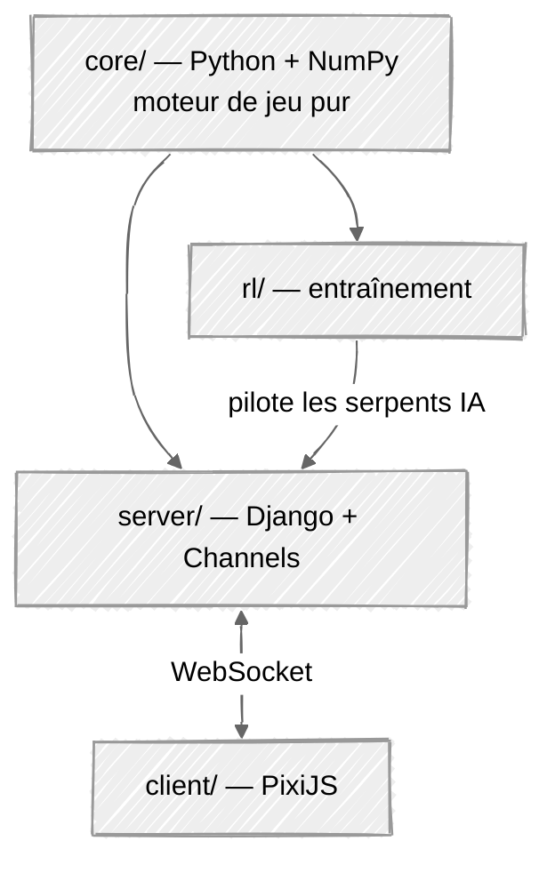

# Slither-Royale

## Contexte et définition du projet

### Objectif

Notre objectif est de réaliser un projet qui implique le développement d'un modèle de reinforcement learning (apprentissage par renforcement).

### Critères du projet

Les critères attendus sont les suivants :

- Un résultat visuel, qui peut être facilement présenté à l'oral
- Utilisation de Django
- Implémentation d'un composant réseau
- Un projet réaliste

Notre projet consiste donc à créer un jeu vidéo (visuel) multijoueur (composant réseau).

### Ressources

On dispose de 12 séances de 3h15 pour réaliser le projet, soit environ 36h de travail au total. Le projet sera réalisé en groupe de 3 personnes, ce qui donne une petite centaine d'heures allouées en tout pour le projet.

Les ressources nécessaires au projet sont :

| Ressource | Solution choisie |
| --- | --- |
| Hébergement Django | Une VM hosting de Minet sera privilégiée, pour des raisons de coût : l'hébergement est gratuit pour les adhérents Minet. |
| Librairies utilisées | Nous avons choisi d'utiliser uniquement des librairies sous licence MIT (à compléter avec d'autres licences à droit d'utilisation gratuit), afin de ne pas avoir de problème de droit d'auteur. |
| Entraînement des modèles | L'utilisation de Google Colab est privilégiée pour l'entraînement des modèles, afin de ne pas avoir de problème de ressources matérielles, et de profiter d'infrastructures puissantes mises à disposition gratuitement. |

## Principe du jeu

Slither Royale est une adaptation façon remix de Slither.io en battle royale.

16 joueurs incarnent un serpent (abstrait) vu de dessus, sur une carte circulaire en 2D. Le serpent avance continuellement vers l'avant, et le joueur peut le diriger vers la droite ou la gauche, en direction du curseur de la souris.

Lorsqu'un serpent entre dans un autre serpent (sa tête touche l'autre serpent), il disparaît et perd la partie. L'objectif des joueurs est d'être le dernier serpent sur la carte.

Le joueur est récompensé pour l'élimination d'autres serpents, et un système de zone de jeu est mis en place pour forcer les joueurs à se rapprocher les uns des autres au fur et à mesure que le temps passe.

## Architecture

### Un cœur, deux façades

### Règle d'or

`core/` ne connaît ni Django, ni WebSocket, ni Gymnasium. Il expose une seule opération : `tick(actions) -> nouvel état`. Il ne dort jamais, ne lit jamais l'heure, n'ouvre aucune socket.

- **L'entraînement** appelle `tick()` en boucle serrée, aussi vite que le CPU le permet.
- **Le serveur** appelle exactement le même `tick()`, mais cadencé par une horloge.

### Découpage des dossiers

| Dossier | Rôle | Dépend de |
| --- | --- | --- |
| `core/` | Règles du jeu : déplacement, collisions, zone, conditions de victoire | NumPy uniquement |
| `rl/` | Environnement d'entraînement, encodage des observations, récompenses, scripts de training | `core/`, Gymnasium, Stable-Baselines3 |
| `server/` | Projet Django : lobby, comptes, historique, et boucle de partie temps réel | `core/`, Django |
| `client/` | Rendu PixiJS, capture de la souris, interpolation | — (parle au serveur en WebSocket) |

### Périmètre de la v1

Chaque mécanique ajoutée coûte du temps de développement et rend l'entraînement plus difficile. La v1 se limite donc au strict nécessaire :

- Survie pure : longueur fixe, vitesse constante, pas de nourriture.
- Une seule action possible : tourner à gauche, tout droit, ou à droite.
- Une zone de jeu qui rétrécit pour forcer la confrontation.

La croissance sur élimination et les boosts de vitesse sont des extensions envisagées seulement si le temps le permet.

## Choix techniques

### Cœur de jeu

| Retenu | Pourquoi | Écarté |
| --- | --- | --- |
| Python + NumPy | Même langage que l'entraînement et que Django : un seul moteur, aucune réimplémentation. NumPy traite les 16 serpents d'un coup et évite le coût d'un objet Python par segment. | **Moteur JS partagé client/serveur** : imposerait un pont Python↔JS pour l'entraînement RL. |

### Entraînement

| Retenu | Pourquoi | Écarté |
| --- | --- | --- |
| Gymnasium | Interface standard `reset()` / `step()`. Rend le moteur compatible avec tout l'écosystème RL sans code spécifique. | — |
| Stable-Baselines3 (PPO, sur PyTorch) | PPO fiable et déjà éprouvé. Nous écrivons nous-mêmes ce qui est propre au projet — observations, récompenses, self-play. | **PPO écrit à la main** : beaucoup d'architecture en plus, pour un résultat au mieux équivalent. Autant respecter le DRY de Python. **RLlib** : conçu pour du calcul distribué, surdimensionné ici. |
| Self-play : 16 serpents, une seule politique | Un seul monde simulé produit 16 transitions par tick au lieu d'une : les données sont quasi gratuites, et les adversaires progressent en même temps que l'agent. | **Adversaires scriptés uniquement** : l'agent apprend à battre des bots, pas à jouer. Conservés seulement comme point de départ. |
| Google Colab | GPU gratuit (TPU v5e) | Machine personnelle seule : limitante pour des gros runs. |

### Serveur

| Retenu | Pourquoi | Écarté |
| --- | --- | --- |
| Django | Imposé par le cahier des charges, et pertinent : lobby, comptes et historique de parties passent par l'ORM et l'admin, quasi gratuitement. | — |
| Django Channels (ASGI) | Apporte le WebSocket dans Django : un seul projet, un seul déploiement, et la session Django sert directement à identifier le joueur. | **Serveur temps réel séparé (Node, FastAPI)** : deux services, deux déploiements, et l'authentification à repartager. |
| WebSocket | Bidirectionnel, faible latence, natif dans le navigateur. | **Polling HTTP** : latence inacceptable. **WebRTC / UDP** : gain réel, mais complexité sans rapport avec 16 joueurs sur une carte réduite. |
| Serveur autoritaire | Seul l'état du serveur fait foi ; le client n'envoie qu'une direction souhaitée. Anti-triche par construction. | **Client autoritaire** : triche triviale et clients désynchronisés. |
| IA en remplissage de slots | La partie compte toujours 16 serpents : les humains connectés, l'IA pour le reste. Résout le problème « personne en ligne le jour de la démo » et met le modèle entraîné en valeur directement dans le jeu. | **Mode démo séparé** : découplage plus simple, mais l'IA n'est plus qu'une vidéo à côté du jeu. |
| Persistance des résultats de partie uniquement | Écrire chaque tick en base n'apporte rien et écroule les performances. | Journalisation tick par tick. |

### Client

| Retenu | Pourquoi | Écarté |
| --- | --- | --- |
| PixiJS | Rendu WebGL 2D. Sprites, traînées et effets lumineux disponibles d'origine. | **Canvas 2D brut** : viable, mais rendu plus pauvre pour une démonstration orale. **Three.js** : moteur 3D, inadapté à une carte 2D. |

### Hébergement et licences

| Retenu | Pourquoi | Écarté |
| --- | --- | --- |
| VM Minet, un processus ASGI derrière nginx | Coût nul pour les adhérents, contrôle total, WebSocket sans restriction. Une partie tient largement dans un seul processus. | **PaaS gratuit** : WebSockets souvent limités, ou connexion coupée après inactivité. |
| Librairies sous licence MIT ou équivalent libre d'usage | Aucun risque de droit d'auteur sur un projet rendu et présenté. Django (BSD), PixiJS (MIT), PyTorch (BSD), Stable-Baselines3 (MIT) et NumPy (BSD) satisfont tous ce critère. | Toute dépendance sous licence restrictive ou commerciale. |

### Répartition indicative de l'effort

(Les estimations sont a titre indicative elle peuvent varier selon les imprévus et la complexité rencontrée)

| Lot | Estimation |
| --- | --- |
| Cœur de jeu et tests de déterminisme | 15 h |
| Environnement RL : observations, récompenses, self-play | 15 h |
| Entraînement, réglages, sélection de la politique | 20 h |
| Django : lobby, comptes, boucle de partie Channels | 20 h |
| Client PixiJS : rendu, entrées, interpolation | 20 h |
| Intégration, déploiement, préparation de l'oral | 10 h |

Un autre avantage de cette implémentation est qu'une fois le cœur de jeu posé, les autres parties peuvent être développées en parallèle : l'entraînement avance en même temps que le serveur et le client.

